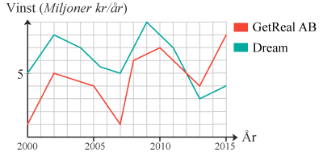

# Digitalt system från sensor till visualisering
## Introduktion
Epoxi är en form av tvåkomponentshärdplast som bland annat används som golvyta i lokaler så som industrier, storkök och garage. Epoxi är ett fuktkänsligt material och en för hög luftfuktighet gör att härdprocessen (torkningstiden) går för långsamt och man riskerar golvets hållbarhet. En för låg luftfuktighet gör istället att materialet härdar (torkar) för fort och processen blir extremt stressig. Därför är det av stor vikt att mäta luftfuktighet i lokaler där epoxi ska användas.  

**Såhär kan epoxi se ut:**

## Projektbeskrivning
- Målgrupp: yrkeshantverkare som arbetar med att installera fogfria industrigolv
- Sensor: Luftfuktighetssensor kopplat mot app
- Syfte: Kontrollera luftfuktigheten vid applicering av epoxi
- Kontext: Stressiga miljöer ofta i industrilokaler med varierande funkt
- Problem: Konsekvenser ifall man lägger epoxi vid för hög luftfuktighet: att det inte torkar som det ska, bubblor kan bildas, missfärgning och minskad hållbarhet! Konsekvenser vid för låg luftfuktighet är att plasten härdar för fort. 
- Kunskap: Genom att se trenden på luftfuktigheten under och innan torkningstiden så minimerar det risken för att materialet ska härda för snabbt eller för långsamt.
- 

